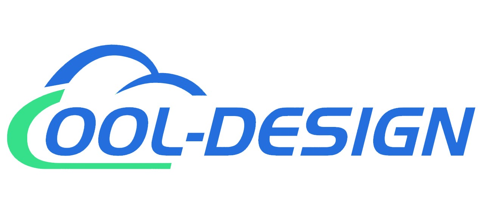

<h1 align="center">
  An cool-design for Vue
</h1>

    
    
    

An enterprise-class UI components based on Ant Design and Vue.

### Features
- A set of high-quality Vue components out of the box.
- Multiple components
- Cool design system

### Browsers

Modern browsers and IE10.

|  IE / Edge |  Firefox |  Chrome |  Safari |  Opera |
| --- | --- | --- | --- | --- |
| IE10, Edge | last 2 versions | last 2 versions | last 2 versions | last 2 versions |

